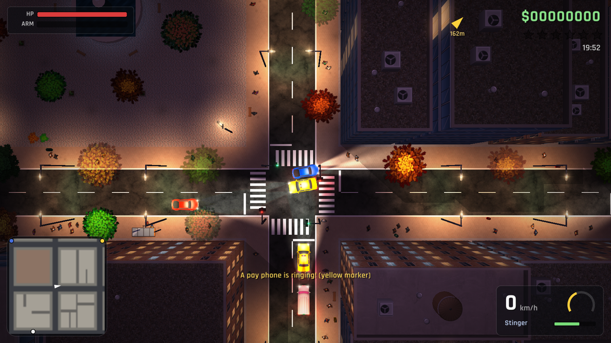

# Concrete Jungle

A top-down open-city action game in the spirit of GTA 1 and GTA 2, written in C++17 with [raylib](https://www.raylib.com/) 6.0. The classic overhead view is rendered as real 3D geometry, so buildings lean with perspective and bridges hide what passes beneath them.

> **Status:** early development. The game is playable end to end; the vehicle handling and damage models are being reworked. See the [backlog](docs/backlog.md).



## Features

| Area | Highlights |
|---|---|
| City | A procedurally generated 584 × 584 m island: streets with traffic lights, buildings with rooftop detail, parks, plazas, parking lots, a police station and a hospital, gate buildings, skybridges and an elevated metro with a running train |
| Rendering | Perspective top-down camera, day/night cycle with sun shadows, headlights and street lamps, lit windows and neon, bloom |
| Traffic | Lane-following traffic that obeys signals and junction rules, overtakes, honks and makes U-turns; drivers stopped nose to nose give way to each other; physical recovery or persistent holding after a knock; calm, normal and aggressive drivers, and after a collision an aggressive one may get out to argue or fight, then drives the same car on; police pursuits |
| Physics | Sub-stepped rigid-body contact solver, crash damage based on delta-V, breakaway lamp posts, hydrants and other street furniture |
| Pedestrians | 300 people around the player who walk their blocks, queue at the kerb and cross safely at the lights, jump out of the way of vehicles, flee gunfire and violence, sometimes fight back, and are hurt realistically by vehicles |
| Gameplay | On-foot combat with six weapons, carjacking, a six-star wanted level, arrests, missions from ringing pay phones, pickups |
| Audio | Every sound synthesised at start-up; any of them can be replaced with a WAV file |
| Content | Vehicles, characters, weapons and foliage defined in plain-text data files |

## Quick start

### Play

You need 64-bit Windows and a graphics card that supports OpenGL 3.3.

1. Download `ConcreteJungle-<version>-windows-x64.zip` from the newest release on the [releases page](https://github.com/guyleslie/Concrete-Jungle/releases) and extract it.
2. Double-click `ConcreteJungle.exe` in the extracted folder. The executable is not signed, so Windows SmartScreen may warn about it: choose *More info › Run anyway*.

The game runs full screen at your monitor's resolution. Press Enter on the title screen, F1 for help, Esc to pause and Q in the pause menu to quit. Keep the executable next to the `assets/` folder: the game loads its data, textures and fonts from there.

### Build from source

You need the same, and about 2 GB of disk space for raylib and its tools.

1. **Install raylib 6.0.** Download the *raylib 6.0 Windows Installer (64bit)* from [itch.io](https://raysan5.itch.io/raylib) and run it. It installs raylib together with the w64devkit GCC compiler the game is built with, by default into `C:\raylib`.
2. **Get the source.** Clone the repository, or download it from GitHub as a ZIP (*Code › Download ZIP*) and extract it:

   ```bash
   git clone https://github.com/guyleslie/Concrete-Jungle.git
   ```

3. **Build.** Open a Command Prompt in the project folder (in File Explorer, type `cmd` into the address bar and press Enter), tell the build script where raylib is installed, and build:

   ```bat
   set RAYLIB_DIR=C:\raylib
   ```

   ```bat
   build.bat
   ```

   The build takes about a minute and ends with `Built ConcreteJungle.exe`; the game is then in the project folder. If the build cannot find raylib, it says so: check `RAYLIB_DIR`.

   In PowerShell (the default of Windows Terminal), the same two commands are `$env:RAYLIB_DIR = "C:\raylib"` and `.\build.bat`. In Git Bash, run `RAYLIB_DIR=/c/raylib sh build.sh`: it recompiles only the changed files, and the game it builds opens a console window with its log.
4. **Play.** Double-click `ConcreteJungle.exe` in the project folder, as in [Play](#play).

Other build options (debug builds, CMake, Linux and macOS), packaging a release and troubleshooting are in the [build guide](docs/guides/building.md).

## Controls

### On foot

| Key | Action |
|---|---|
| W A S D / arrow keys | Move (the character faces where it walks) |
| Shift | Run |
| Right mouse button (hold) | Aim at the cursor, strafe or backpedal |
| Left mouse button | Attack or shoot (also turns towards the cursor) |
| R | Reload |
| 1–6, Q, mouse wheel | Switch weapon |
| E / F / Enter | Enter or hijack a vehicle |

### Driving

| Key | Action |
|---|---|
| W / S | Throttle; brake, then reverse |
| A / D | Steer |
| Space | Handbrake |
| E / F / Enter | Get out |
| H | Horn |
| L | Headlights: auto / on / off |
| G | Siren (emergency vehicles) |

### General

| Key | Action |
|---|---|
| T (hold) | Fast-forward time |
| F1 | Show or hide help |
| F3 | Debug information |
| Esc / P | Pause (Q quits from the pause menu) |
| Alt+F4 | Quit |

## Documentation

| Document | Contents |
|---|---|
| [Documentation index](docs/README.md) | Everything below, plus the design document for each subsystem |
| [Architecture](docs/architecture.md) | Modules, frame lifecycle, units and conventions |
| [Building](docs/guides/building.md) | Toolchain, build options, troubleshooting |
| [Adding content](docs/guides/adding-content.md) | New vehicles, characters, weapons, foliage and sounds without code changes |
| [Testing](docs/testing.md) | Automated scenario runs and their metrics |
| [Vehicle handling baseline](docs/design/vehicle-handling-baseline.md) | Measured class performance and collision findings before the CJ-002 physics rework |
| [Backlog](docs/backlog.md) | Planned work with priorities and acceptance criteria |
| [Changelog](CHANGELOG.md) | Notable changes per milestone |
| [Contributing](CONTRIBUTING.md) | Workflow, coding style, commits and documentation conventions |

## Project layout

```text
assets/   data files (assets/data/*.cfg), textures, sprites, fonts
docs/     project documentation
src/      C++ sources, one module per subsystem
tools/    helper scripts: derived art, sprite export, documentation check, release packaging
```

## Credits and licensing

The project's own code is licensed under the [MIT licence](LICENSE). Third-party assets keep their own licences, listed in [CREDITS.md](CREDITS.md). The "Survivor" character by Riley Gombart is licensed under CC-BY 3.0 and is credited on the title screen.
