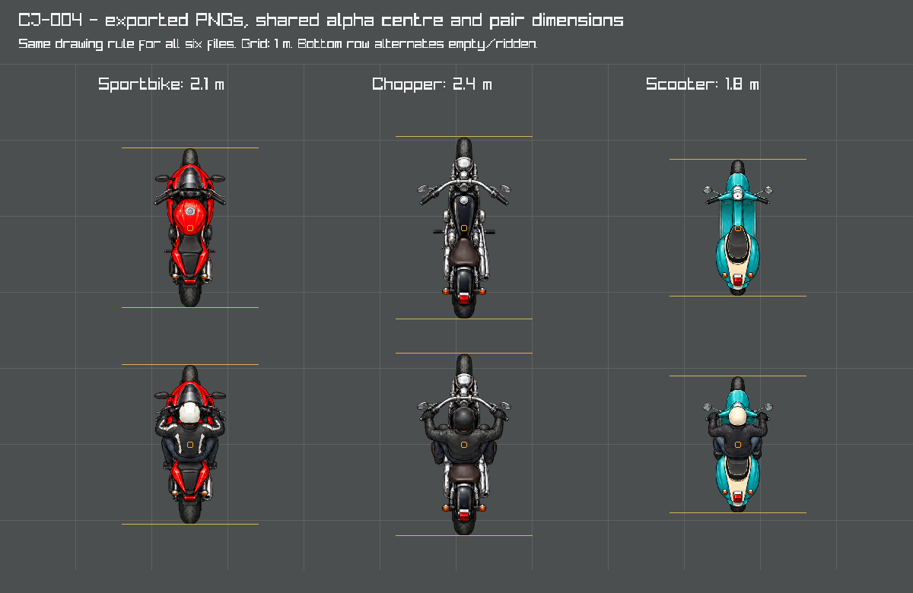
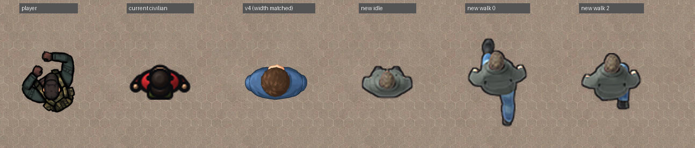
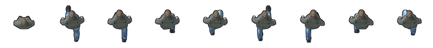
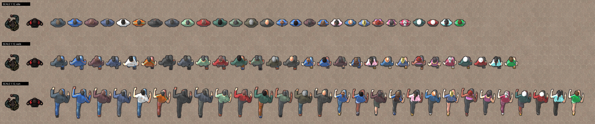

# CJ-004 art preparation

The user accepted the motorbike designs on 2026-10-07, subject to correct size, and rejected the earlier civilian sheets and idle masters. The accepted bike source is preserved, and its six exports, which follow the shared vehicle convention below, replaced the procedural motorbikes in the game on 2026-10-07, and the user accepted them in a playtest on 2026-10-08. Since 2026-10-08 the civilians are rendered from 3D models instead of generated images; the generated civilian art below is superseded. The user playtested and accepted the civilians on 2026-10-08, which completes CJ-004.

## Motorbike exports

| Class | Empty PNG | Ridden PNG | Active alpha bounds (x, y, width, height) |
|---|---|---|---|
| Sportbike | [Empty](../../vehicles/sportbike-empty.png) | [Ridden](../../vehicles/sportbike-ridden.png) | 154, 32, 204, 448 px |
| Chopper | [Empty](../../vehicles/chopper-empty.png) | [Ridden](../../vehicles/chopper-ridden.png) | 140, 32, 232, 448 px |
| Scooter | [Empty](../../vehicles/scooter-empty.png) | [Ridden](../../vehicles/scooter-ridden.png) | 140, 32, 232, 448 px |

The game loads them from `assets/vehicles/` through the `BIKE` records in [vehicles.cfg](../../data/vehicles.cfg).

The [original sheet](motorbike-sheet.png) is 1,536 × 1,024 px: three columns (sport, chopper, scooter), empty bikes above ridden bikes. Its checksum and visual acceptance are recorded in [motorbike-lock.json](motorbike-lock.json). Do not repaint or regenerate the accepted designs to correct packing.

## Shared vehicle convention

- New vehicle exports are 512 × 512 px RGBA PNGs, viewed vertically from above, front facing up (−Y).
- Visible alpha bounds at the runtime threshold of 0.1 have a height of 448 px, from y = 32 px to y = 480 px, and centre (256, 256) px. Use an even width derived from the vehicle's aspect ratio.
- Empty and ridden versions use the same active width, height and centre. The artwork is registered during export. Canvas padding alone is insufficient because the current loader trims alpha independently.
- Position and size corrections belong in the exported pixels. Do not add per-image pivot, offset or scale overrides to the runtime data. Class dimensions in [vehicles.cfg](../../data/vehicles.cfg) remain ordinary physical data.
- Keep genuine transparent padding, soft alpha edges and complete silhouettes. Do not add nearly invisible pixels to manipulate the measured bounds.

The renderer applies the same alpha-trimmed centre/aspect rule to every vehicle and scales its active height to the class length; these exports need no exceptions. The full widths in the [export measurement](motorbike-export-check.json) include the handlebars and mirrors, which the art draws about 30 % wider than on real bikes, so they are not the collision widths: `WIDTH` records in [vehicles.cfg](../../data/vehicles.cfg) give the handlebar width of real bikes, and the drawn mirrors overhang the collision box. [CJ-023](../../../docs/design/street-geometry-proposal.md#vehicle-widths) adds the cars' widths.

## Export and verification

[tools/export_cj004_bikes.cpp](../../../tools/export_cj004_bikes.cpp) crops the source cells, resamples their active bounds into the common layout and writes the PNGs to `assets/vehicles/`. The empty member determines each pair's aspect; small source differences are corrected in the exported pixels. The largest relative aspect correction is about 2.4 % for the ridden sportbike. The accepted source is unchanged. The tool is an offline exporter and check gallery; the game does not read its measurements or the lock file.

Build with the project's compiler and raylib paths:

```powershell
& 'E:\Apps\raylib\w64devkit\bin\g++.exe' -std=c++17 -O2 -Wall -Wextra -Wno-missing-braces -I'E:/Apps/raylib/raylib/src' tools/export_cj004_bikes.cpp -o build/scratchpad/export_cj004_bikes.exe -L'E:/Apps/raylib/raylib/src' -lraylib -lopengl32 -lgdi32 -lwinmm -static
& '.\build\scratchpad\export_cj004_bikes.exe' --export
```

Run without `--export` to check the saved PNGs and view the gallery without rewriting them. The check reads the actual exported files and uses the same `GetImageAlphaBorder(..., 0.1f)` as the vehicle loader. Baseline source bounds differ between pair members; all six exports pass identical centre/height checks and equal pair bounds. The alternating gallery supports inspection of exposed wheels and handlebars; matching bounds do not imply identical internal source pixels.



The exporter compiles without warnings, and its check passes on the files in `assets/vehicles/`. In the game the empty and ridden images switch without a visible jump: the uncovered front tyre and tail differ by at most 1 px (0.5 cm) between the pair members. There is one look per class. More colours come as more exported pairs and `BIKE` lines, because the game's automatic paint variants also recolour the lights and cannot recolour the black chopper. The user playtested and accepted the motorbikes on 2026-10-08.

## Rejected civilian experiments

[civilian-relaxed-sheet.png](civilian-relaxed-sheet.png) is a rejected 22-pose experiment, not an integration candidate or master reference. Defects include head/body proportions, anatomy, repeated or unclear gait phases and limbs crossing cell boundaries. Do not extract it into a runtime atlas.

Earlier idle attempts projected arms and legs forward. [V3](civilian-idle-master-v3.png) hid the legs but was rejected for enormous rounded shoulder/upper-arm blobs. Preserve failed experiments; do not animate them.

[V4 idle master](civilian-idle-master-v4.png), based on the [revised upright pose guide](civilian-upright-pose-guide-v2.png), was the last generated candidate. It was not reviewed further: image generation could not deliver a consistent, correctly projected walk cycle, so the [revised prompts](civilian-prompts-v2.md) are superseded by the 3D pipeline below.

## Civilian 3D pipeline

Civilians are built from 3D human models, animated, and rendered straight from above in Blender. The geometry, the walk cycle and the frame registration then come from the model rather than from an image generator.

| Part | Source | Licence |
|---|---|---|
| Body, clothes, hair, skins | [MakeHuman](https://static.makehumancommunity.org/assets/assetpacks.html) asset packs: system assets, shirts01, pants01, shoes01, hair01, skins01, eyebrows01 | CC0 |
| Character tool | [MPFB 2.0.17](https://extensions.blender.org/add-ons/mpfb/), the MakeHuman add-on for Blender | GPL-3.0 (a tool; its output is not covered) |
| Animations | [Universal Animation Library](https://quaternius.com/packs/universalanimationlibrary.html) by Quaternius, Standard | CC0 |

### Setting up

1. Install Blender 5.2. Install the MPFB extension from its zip (`blender --command extension install-file -r user_default -e add-on-mpfb-v2.0.17.zip`) and load the asset pack zips with MPFB's *Load pack from zip file*.
2. Download the Universal Animation Library (Standard) from itch.io and unpack it. The scripts use `Unreal-Godot/UAL1_Standard.glb`, the version without root motion.
3. Keep downloads, unpacked packs and `.blend` files in `build/art-sources/`, which Git ignores.

### Steps

| Script | What it does |
|---|---|
| [build_civilian.py](../../../tools/cj004/build_civilian.py) | Builds a civilian from a look file ([example](../../../tools/cj004/look-civilian-01.json)): MakeHuman macro details, skin, clothes, hair and the `game_engine` rig |
| [retarget_ual.py](../../../tools/cj004/retarget_ual.py) | Copies library actions onto the civilian. The library rests in a T-pose and MPFB in an A-pose: the civilian is first posed along the library's rest bones, then every frame takes the library bone's world rotation times the constant roll offset, so hip and shoulder twist carries over. Modifiers adjust the gaits (see [Gaits](#gaits-cj-029)) |
| [gaits.py](../../../tools/cj004/gaits.py) | The gait settings that the scripts below share |
| [tune_gait.py](../../../tools/cj004/tune_gait.py) | For one look, tries each gait's hip-swing shifts and upper-body corrections and keeps the one that shows as much leg ahead of the body as behind it from above |
| [render_civilian.py](../../../tools/cj004/render_civilian.py) | Renders frames straight from above: orthographic, 1.4 m × 1.4 m per frame (the atlas frame before `CHAR_SCALE`), 384 px, facing the top of the image, sun from the upper left. Also writes a mask of the legs and shoes. The `idle` pose is built in the script: upright, arms hanging, feet under the hips |
| [measure_gait.py](../../../tools/cj004/measure_gait.py) | Stride (how far the foot that carries the weight travels per cycle), the walk frames that split it evenly, foot slip with the frames advanced as the game plays them, thigh swing, toe reach, the spread from the front toe to the back foot, and the upper body's hand travel, arm width, lean and shoulder turn |
| [measure_frames.py](../../../tools/cj004/measure_frames.py) | Visible legs and shoes, how far the legs show beyond the body ahead and behind, width and length of the silhouette, body centre drift and the silhouette change between frames, including the wrap-around of a cycle |
| [stylize.py](../../../tools/cj004/stylize.py) | Reduces a render to the 96 px atlas frame with more contrast and saturation and a dark contour, like the player and the procedural civilians |
| [make_civilians.py](../../../tools/cj004/make_civilians.py) | Runs the steps for every look in [looks.json](../../../tools/cj004/looks.json), writes the atlases and checks them (see [Full set](#full-set-2026-10-08)) |
| [compare_scale.py](../../../tools/cj004/compare_scale.py), [walk_preview.py](../../../tools/cj004/walk_preview.py), [atlas_preview.py](../../../tools/cj004/atlas_preview.py), [preview_frames.py](../../../tools/cj004/preview_frames.py), [debug_side.py](../../../tools/cj004/debug_side.py) | Comparison of renders at game scale on the sidewalk; looks walking, jogging and running as the game plays them (animated); the finished atlases frame by frame; a contact sheet with the visible legs marked; side views of a retarget next to the library mannequin. The two atlas previews read the frame layout, the strides and the cadences from [civilians.cfg](../../data/civilians.cfg) through [civilians_cfg.py](../../../tools/cj004/civilians_cfg.py) |

### Proof of concept (2026-10-08)

One civilian (jacket, jeans, dark shoes, short brown hair, 1.69 m) with the upright idle and an eight-frame walk, rendered, stylized and compared at game scale:





| Criterion | Result |
|---|---|
| Idle: visible legs and shoes at most 4 % of the silhouette (the user's choice; 0 px is impossible, because standing upright the toes reach beyond the chest) | 3.3 % with the jacket; 10.7 % with a slimmer sweater |
| Width within ±10 % of the player's 0.65 m | Idle 0.59 m (−9 %), walk 0.68–0.69 m (+5 %) |
| The walk loops: the step from frame 7 to frame 0 like the others | Silhouette change 0.0327 against 0.0233–0.0377 |
| Pelvis drift | Front to back 0.02 px; side to side 3.1 px (4.5 cm), the natural sway of a walk, averaging at the frame centre |

The library's `Walk_Loop` swings bent arms with closed fists, like a boxer; `Walk_Formal_Loop`, with relaxed hanging arms, is the civilian walk. The library's `Idle_Loop` stands contrapposto with one leg back (23 % legs) and is not used. Walking leans the body slightly forward, so the silhouette lengthens a little when a civilian sets off. A raw render reads grey on the sidewalk; the stylized frames match the game. A grey jacket still blends in; the variants need firmer colours.

### Full set (2026-10-08)

[make_civilians.py](../../../tools/cj004/make_civilians.py) builds every look of [looks.json](../../../tools/cj004/looks.json) and writes `assets/characters/civilians/<id>.png`: 22 frames of 144 px, 2.1 m each (a running stride and a punch need about 2 m; the 96 px / 1.4 m frames of the procedural atlas fit only a walk). It runs three looks at a time; the full set takes about 35 minutes on the CPU. `--poses idle,fist` re-renders only those frames, `--summary` re-checks the report.

| Frames | Content | Source |
|---|---|---|
| 0–7 | Walk | `Walk_Formal_Loop`, every fourth frame |
| 8 | Idle | Built by the render script |
| 9 | Lying, real size | Last frame of `Death01`, turned head up and centred |
| 10, 11 | Right and left punch | `Punch_Cross` frame 7, `Punch_Jab` frame 5 (the hand furthest forward) |
| 12, 13 | Raised fist, two shake positions | Built by the render script |
| 14–21 | Run | `Sprint_Loop`, every second frame, upper body leaned back by 25° |

What the full set changed in the pipeline:

- **Torso retarget.** Aiming MPFB's torso bones along the library's tipped the hips and added about 10° of forward lean, because the two rigs' pelvis bones point different ways. The torso now keeps its own rest orientation; the walk leans 12° from pelvis to head (the library 11°).
- **Run.** The library's sprint leans about 40° from pelvis to head; a runner at 5 m/s leans 15–20°, and from above the steep lean shows the whole back, so a runner looked twice the size of a walker. The upper body is leaned back by 25° (to about 23°). The sprint's cadence matches the 5.2 m/s of a fleeing civilian; the jog's would need 1.9 m steps.
- **Registration.** Every standing job is centred on its mean pelvis position: idle, walk and run share the pivot, and the pelvis averages at the frame centre.
- **Stance.** Standing, the hips are a few centimetres in front of the ankles. The render script searches feet 0–8 cm back and 3–9° inwards for the stance that shows the least of the legs and shoes, separately for every look: slim shoes hide best with the feet back, boots and sneakers with the feet under the hips.
- **Heights.** MakeHuman's race and age settings shift its heights a lot (an Asian man came out 1.45 m tall). A look gives its height in metres, and the build script searches the height slider until the body matches.
- **Clothes.** Baggy trousers show their seat beside a slim torso: harem and cargo trousers, the overalls and two pairs of bulky shoes were replaced.

Results: every look meets the per-look criteria: idle legs and shoes at most 4 % of the silhouette (0.3–3.9 %), walk and run cycles closed, pelvis cycle mean at the frame centre. Width is a property of the set (agreed with the user): drawn with `SCALE 1.12`, the average man is 0.60 m wide standing (−7 % of the player) and 0.70 m walking (+7 %); women keep their real proportions (0.51 and 0.60 m).



### Gaits (CJ-029)

The library's walk lifts the knee 50° and leaves the trailing leg far behind; seen from above, the user found that unnatural. On 2026-10-08 the user chose a compact stride, every leg joint at 0.65 of the library's motion (0.55 jogging, 0.5 running). The playtest of 2026-10-09 then found the legs showing far behind and hardly ahead, the short steps looking nervous, the walking arms swinging too much and the run looking calmer than the walk. The user chose these gaits from variants shown in motion:

| Gait | Legs | Upper body | Frames | Plays |
|---|---|---|---|---|
| Walk | The library's, a real walker's stride; the knee lifted at most about 29° | Arms and shoulders move half as much as the library's; the arms hang 5° closer to the body, about as close as standing | 16, moved so that they split the stride evenly | By distance, at the look's measured stride |
| Jog | 0.85 of the library's, the knees 0.7 | Leaned back 18° | 8: frames 0–19.25 in steps of 2.75 | By cadence, 2.5–2.8 steps/s from 2.0 m/s |
| Run | The library's | Leaned back 25°, so that about 22° remains and the pumping arms show from above | 8: every second frame | By cadence, 2.8–3.3 steps/s from 4.0 m/s |

[gaits.py](../../../tools/cj004/gaits.py) holds these settings. For every look, [tune_gait.py](../../../tools/cj004/tune_gait.py) tries hip-swing shifts and upper-body corrections and keeps the one that shows as much leg ahead of the body as behind it from above; the looks' builds differ, and so do their settings (hip swing 0–4° walking, 10–18° jogging, 18–24° running). `make_civilians.py --retarget` animates again from the existing build and tuning, for a change to `gaits.py` that leaves the tuning alone.

The retarget modifiers of [retarget_ual.py](../../../tools/cj004/retarget_ual.py), in the order a request lists them:

| Modifier | Effect |
|---|---|
| `=+<frames>` | Keys every whole frame and these frames exactly. The library keys its actions every 0.8 frames, so a fast leg between two whole frames was off by up to 6 cm |
| `~a,c` | Turns each leg about the hip so that the thigh's forward swing becomes a × angle + c |
| `^t,s` | Caps the knee lift: beyond t degrees, the thigh goes only s of the rest of the way |
| `&k,deg` | The spine, neck, head and arms move k of their motion about their mean over the cycle; the arms hang deg degrees closer to the body |
| `@deg` | Leans the upper body back about the hips |
| `*k,knee,hips` | The leg joints move k of the way from standing straight (the knee, ankle and toes `knee`); the hips sway, bob and turn `hips` of their motion about their mean, so that a planted foot does not slide sideways under them |

[measure_gait.py](../../../tools/cj004/measure_gait.py) treats the heel and the ball as contact points of their own, because a planted foot rolls from one to the other. A point is on the ground while it moves backwards relative to the body within 3 cm of its lowest, and the weight is on the lowest such point of the front foot. The stride is that point's travel over the cycle. The measure of 2026-10-08 followed only the flat foot and overstated the stride (civilian-01: 1.03 m against 0.92 m), so the feet slid a few centimetres a step. [measure_frames.py](../../../tools/cj004/measure_frames.py) measures how far the legs show beyond the body from the leg mask alone, because the colour render's softer edge makes the rim of a leg count as body. Since CJ-004 the right hand's fingers had stayed spread in every animated frame: the raised-fist pose turns them to Euler rotations, which an action's quaternion keys do not move. The render script now resets them.

The atlas is 38 frames: walk 0–15, idle 16, lying 17, punches 18–19, fist 20–21, jog 22–29, run 30–37, declared by the `ANIM` records of [civilians.cfg](../../data/civilians.cfg).

Results for the 28 looks (2026-10-09):

| Measure | Walk | Jog | Run |
|---|---|---|---|
| Stride per cycle (two steps) | Men 1.19–1.38 m, women 1.11–1.26 m | By cadence | By cadence |
| Steps per second at 1.3 m/s | Men 1.89–2.18, women 2.07–2.35 | — | — |
| Legs beyond the body, ahead / behind | 0.25–0.35 / 0.26–0.35 m | 0.27–0.34 / 0.28–0.35 m | 0.28–0.35 / 0.28–0.35 m |
| Front toe to back foot | 0.72–0.89 m | 1.12–1.40 m | 1.11–1.38 m |
| Planted-foot slip | At most 1.0 cm | None: a foot touches the ground for a frame at most | None |
| Knee lift | 28.4–28.8° | — | — |
| Hands' fore-aft travel | 0.05–0.07 m | 0.55–0.73 m | 0.47–0.62 m |
| Lean from the pelvis to the head | 3–9° | 14–18° | 20–24° |
| Shoulder turn | 9° (the library 15°) | 86° | 64° |

Before the revision (the set of 2026-10-08), the legs showed 0.00–0.05 m ahead of the body and 0.26–0.37 m behind it walking, none ahead and 0.31–0.42 m behind jogging, and none ahead and 0.38–0.51 m behind running. A walker is now as wide as standing (±1 cm); drawn with `SCALE 1.12`, the average man is 0.61 m wide walking (−6 % of the player).

## Provenance

[prompts.json](prompts.json) preserves the exact built-in image generation/edit prompts and the user's subsequent corrections. The motorbikes were generated without an external image input. The Survivor player by Riley Gombart (CC-BY 3.0) was a civilian camera/style reference, and this project's procedural civilian preview was an earlier pose reference. Keep the existing [Survivor attribution](../../../CREDITS.md#required-attribution). No third-party CC0 pack licence is claimed for the generated artwork.

Some fully transparent source pixels retain coloured RGB. They can look like glows in previews that ignore alpha; inspect a proper composite rather than removing valid transparency.
