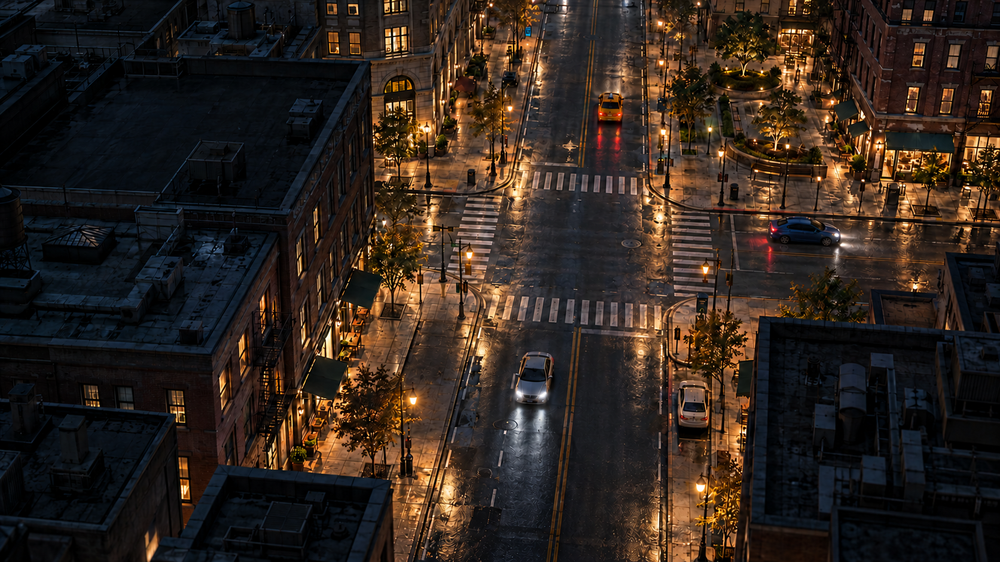

# CJ-030: Final loading background

The user approved this artwork as the final startup-screen background on 2026-10-09. The [loading screen](loading-screen-proposal.md) uses its unchanged runtime copy; the wordmark and loading interface are separate layers.

## Asset record

| Property | Value |
|---|---|
| File | `docs/images/cj030-loading-background.png` |
| Dimensions | 1,672 × 941 px |
| Format | Opaque PNG |
| File size | 2,487,407 bytes |
| SHA-256 | `421c2892e1fc3e0b81b078b0d7b40d9508281664b7454f0aa921aaf7f7f0a152` |
| Creation tool | Built-in ImageGen |
| Approval | Final background accepted by the user on 2026-10-09 |
| Runtime installation | Byte-identical copy at `assets/ui/loading-city.png`, selected by `assets/data/loading.cfg` |

The canonical file and runtime copy preserve the accepted image's bytes. Keep its city composition fixed when packaging. It is atmospheric artwork rather than an exact preview of the generated game map.

## Integration

Use aspect-preserving cover scaling and the safe areas defined in the [responsive layout](loading-screen-proposal.md#composition-and-responsive-layout). Place the two-line ivory/amber wordmark at the upper left and the live four-row status block at the bottom, with the specified contrast gradient.

Use the image at its native size with bilinear filtering. Verify readability and cropping at the target monitor resolutions during implementation. The native image is the approved source; no larger source master is required by this design. Account for approximately 6.0 MiB of RGBA texture storage before mipmaps, within the shared loading-presentation budget.

The [art brief](loading-screen-art-brief.md) specifies the separate wordmark and interface layers. [Credits](../../CREDITS.md#cj-030-loading-screen-background) record the artwork's origin.
