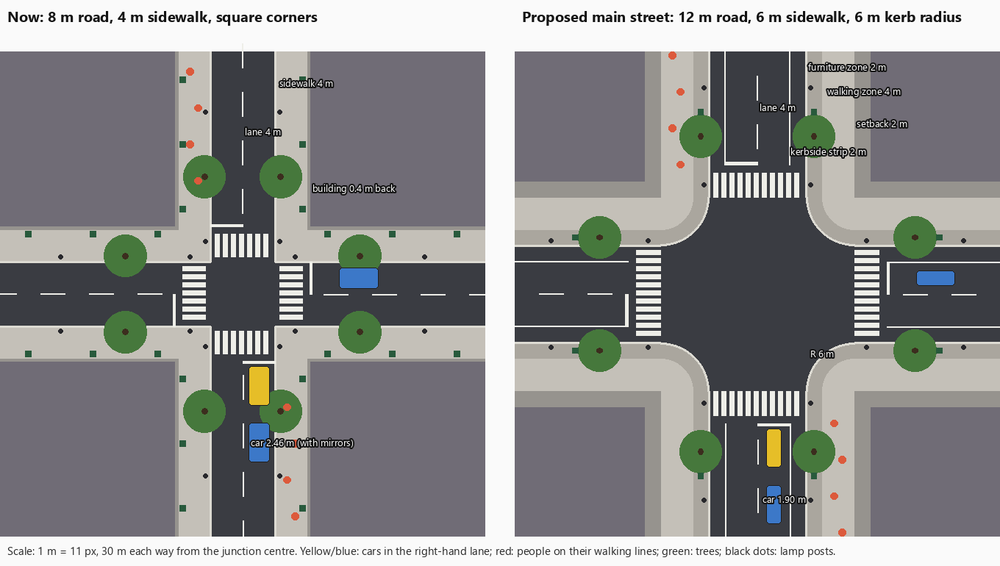

# CJ-023: Street geometry proposal

Agreed specification for real-world vehicle widths and roomier streets, sidewalks and junctions. Drafted and agreed with the user on 2026-10-07; implementation has not started. The current city is documented in [City](city.md), traffic in [Traffic](traffic.md) and people in [Pedestrians](pedestrians.md); none of the targets below are measured results.

## Contents

- [Goals](#goals)
- [Findings](#findings)
- [Decisions](#decisions)
- [Vehicle widths](#vehicle-widths)
- [Street profiles](#street-profiles)
- [Sidewalks](#sidewalks)
- [Junctions](#junctions)
- [Traffic behaviour](#traffic-behaviour)
- [Acceptance criteria](#acceptance-criteria)
- [Measurement plan](#measurement-plan)
- [Delivery](#delivery)
- [Implementation notes](#implementation-notes)
- [Out of scope](#out-of-scope)

## Goals

The playtest feedback of 2026-10-07 ([CJ-023](../backlog.md#cj-023-vehicle-widths-and-street-geometry)): the streets feel cramped, cars and people seem too close together, turns have minor glitches that only wider roads and junctions can fix, and a car leaving the road runs straight into a tree or another piece of street furniture. The user's direction for the city:

- Besides realism, the city must play well, both on foot and in a vehicle.
- Streets may differ in width. Roads have one lane each way today; multi-lane roads are planned for later, so the geometry must allow them.
- Traffic that obeys the rules must never collide while turning. Some drivers may break the rules (run a red light, mount the sidewalk, hit another car), but rarely, never exaggerated.

## Findings

Measured on 2026-10-07 at commit `6cb52fb` (code identical to `d978621`, the [CJ-020 results](traffic-turning-results.md) build).

| Area | Now |
|---|---|
| Vehicle width | `length × sprite aspect ratio`, where the aspect comes from the sprite's alpha bounding box. The box includes the side mirrors and protruding wheels, so the collision box is the mirror-to-mirror width. |
| Sprite bodies | Without mirrors (the median width of the sprite's rows), most cars are already close to real: Stinger 1.83 m, Bruiser 1.87 m, Viper 1.85 m, Police 1.95 m, Van 1.99 m, Taxi 2.04 m. Too wide: Pickup 2.23 m, Ambulance 2.35 m, Semi 2.93 m. |
| Road | 8 m between kerbs: two 4 m lanes, no edge strip; centre line dashed. |
| Sidewalk | 4 m. Lamps 0.6 m and trees 0.7 m from the kerb, hydrants 0.5 m, bus shelters 2.5 m, bins, benches, news boxes, phone booths and shrubs 3.2–3.4 m: furniture across the whole width. People walk 1.4–2.6 m from the kerb. |
| Buildings | 0.4 m behind the sidewalk, so 4.4 m from the kerb. |
| Junction | An 8 × 8 m box with square kerb corners; zebra crossings 4.6–7.4 m and stop lines 8.3 m from the junction centre. |
| Signals | A 16 s cycle: 6 s green, 1.5 s yellow, 0.5 s all-red per direction. |
| Grid | 4 m tiles; a uniform 64 m block pitch (16 tiles); 9 × 9 blocks with 48 m interiors; island 584 m. |
| Rule-breaking | Traffic never runs a red light (only police in pursuit do); traffic mounts the sidewalk only to get round an obstacle when impatient. In `rampage`, a Pickup on a wide right turn and a Bus going straight overlapped by up to 8.9 px. |

## Decisions

The user chose these on 2026-10-07 and accepted the rest of this specification:

| Question | Choice |
|---|---|
| Street widths | Two profiles, both one lane each way: main streets 12 m, side streets 10 m between kerbs |
| The main streets' kerbside strip | Empty for now, behind a solid edge line |
| Block size | The block interiors stay 48 m; the island grows instead |

## Vehicle widths

- A new `WIDTH <class> <m>` record in `vehicles.cfg` gives each class its real body width without mirrors. The collision box, the turn planner, recovery and every other user of `Vehicle::width` take this value.
- The sprite is drawn so that its body width (the median width of its rows, measured on load) equals the class width; mirrors reach beyond the collision box, as on a real car. Most cars change by less than 7 %; the Pickup narrows by about 10 %, the Semi by about 15 %.
- Proposed widths, to be checked against published specifications in step 1 (the references are comparable vehicles, not models the classes claim to be):

| Class | Now, with mirrors | Sprite body | Target | Reference |
|---|---|---|---|---|
| Stinger | 2.11 m | 1.83 m | 1.83 m | Audi A4 |
| Viper | 2.19 m | 1.85 m | 1.91 m | Dodge Viper |
| Bruiser | 2.04 m | 1.87 m | 1.88 m | Dodge Charger |
| Taxi | 2.46 m | 2.04 m | 1.90 m | Toyota Camry to Ford Crown Victoria |
| Pickup | 2.88 m | 2.23 m | 2.00 m | Full-size pickup |
| Van | 2.38 m | 1.99 m | 1.99 m | Ford Transit Custom |
| Limo | 2.35 m | step 1 | 1.88 m | Stretched Bruiser |
| Ambulance | 2.96 m | 2.35 m | 2.30 m | Box-body ambulance |
| Police | 2.24 m | 1.95 m | 1.95 m | Ford Crown Victoria Police Interceptor |
| Bus | 2.92 m | step 1 | 2.55 m | Legal maximum width |
| BoxTruck | 2.33 m | step 1 | 2.45 m | Medium box truck |
| Semi | 3.62 m | 2.93 m | 2.50 m | Tractor unit |
| FireTruck | 2.55 m | step 1 | 2.50 m | Fire engine |
| Garbage | 2.55 m | step 1 | 2.50 m | Refuse truck |
| Sportbike | 0.77 m | — | 0.75 m | Sport motorcycle |
| Chopper | 0.95 m | — | 0.95 m | Cruiser motorcycle |
| Scooter | 0.69 m | — | 0.70 m | Scooter |

## Street profiles

- A new data file, `assets/data/city.cfg`, defines street profiles and assigns one to every grid line, so streets differ in width without code changes ([ADR-0002](../adr/0002-data-driven-content.md)).
- A profile gives: lanes each way (1 for now; the loader rejects more until [CJ-027](../backlog.md#cj-027-multi-lane-roads)), lane width, kerbside strip, sidewalk width split into a furniture zone and a walking zone, building setback and kerb corner radius.
- Lane width stays 4 m in both profiles, so the lane offset of 2 m from the centre line stays as it is.
- The block interiors stay 48 m, so the layouts of buildings, parks, plazas and parking lots keep their sizes; the grid becomes non-uniform and the island grows from 584 m to about 636 m (main streets on lines 0, 3, 6 and 9).
- Surfaces (road, sidewalk, block interior) are computed from the line geometry instead of being looked up in 4 m tiles, which allows any width and curved kerbs. A coarse grid stays only as the spatial index for buildings, objects and people.
- The signal cycle moves to `city.cfg` too, with a longer green: a main-street crossing is 12 m instead of 8 m. Starting values 9 s green, 2 s yellow and 1 s all-red per direction (24 s cycle), tuned by measurement.

| Profile | Lanes | Kerbside strip | Road | Sidewalk (furniture + walking) | Setback | Kerb radius | Kerb to building |
|---|---|---|---|---|---|---|---|
| Now | 1 × 4 m each way | none | 8 m | 4 m, mixed | 0.4 m | square | 4.4 m |
| Main street | 1 × 4 m each way | 2 m, solid edge line | 12 m | 6 m (2 m + 4 m) | 2 m | 6 m | 8 m |
| Side street | 1 × 4 m each way | 1 m | 10 m | 5 m (1.5 m + 3.5 m) | 1.5 m | 5 m | 6.5 m |

The kerbside strip stays empty: room to pull over, to get round a stopped car and for a knocked car; later bus bays ([CJ-026](../backlog.md#cj-026-bus-stops-and-bus-bays)) or kerbside parking may use it.

## Sidewalks

- **Furniture zone** along the kerb: lamps, street trees, traffic signals, bins, benches (facing the walkway), hydrants, news boxes, mailboxes, phone booths, bus shelters, the metro portal columns and the gate-building arcade columns. Nothing solid stands elsewhere on the sidewalk.
- **Walking zone**: clear. People walk on personal lines spread across its middle (main street: about 4 m from the kerb, ±1 m).
- **Setback**: the strip between the sidewalk and the buildings stays clear; parks, plazas and parking lots keep their own surface in it.
- Gaps between solid furniture leave room for a car that leaves the road; the run-off measurement below sets the target.

## Junctions

- The box grows with the roads: 12 × 12 m between two main streets, 10 × 10 m between two side streets.
- Kerb corners are rounded with the profile's radius (at a corner between two profiles, the larger one). The ground, the kerb face, the kerb stones and the markings follow the arc; signals, bollards and the people's waiting spots move to the corners.
- The zebra crossing starts where the arc ends (3 m deep); the stop line is 1 m before it. Between two main streets: zebra 12–15 m, stop line 16 m from the junction centre.
- Turn paths ([Traffic › Turn paths](traffic.md#turn-paths)) are built per junction type (the approach and exit profiles and the corner radius) instead of once per class, against the curved kerbs.

## Traffic behaviour

- Drivers who obey the rules (rail cars on their lane, not knocked, not police, not the player) never collide or overlap while turning. Clean turns for every car class remove the wide turns behind the 8.9 px overlap of CJ-020.
- Rare, measured rule-breaking (red-light running, mounting the sidewalk, misjudged gaps) is a separate item, [CJ-028](../backlog.md#cj-028-rule-breaking-drivers). This item does not add rule-breaking.

## Acceptance criteria

| Area | Criterion |
|---|---|
| Widths | Every class's collision width equals its `WIDTH` record (start-up log); sprites drawn to the body width |
| Turning fixture | For every junction type: every car class turns right and left on a clean path (no wide turns); every large class fits both turns, with at most 1.5 m of encroachment on a wide turn; slip at most 3°; wheels never over a kerb; the other `cj020-turns-v2` limits unchanged |
| City turns | In all six city scenarios: no turn planned that does not fit; zero rail-car overlaps; zero contacts between law-abiding rail cars in or near a junction |
| Run-off | The median free run-off from the kerb at least doubles; on at least half of the kerb length the run-off reaches the building line (or the block interior's edge plus the setback) |
| Clearance | Person-seconds of people walking on a sidewalk within 2 m of a moving vehicle at most a quarter of the before value |
| Pedestrians | `foot` and `day`: on the road off a crossing below 1, traffic hits 0, visible at least 4, fleeing below 1, crossings per minute not fewer than before, pedestrian CPU at most 0.5 ms; `rampage`: at least 70 % escape |
| Traffic | Blocked cars, wait cycles and AI contacts no worse than before; driver decision CPU within the CJ-016 targets except `rampage` ([CJ-024](../backlog.md#cj-024-recovery-cost-in-dense-traffic)) |
| Physics | `crash`, `derby`, `chase`: no deep frames, maximum penetration under 3 px |
| Regressions | CJ-016 recovery, clearance, conflict and incident fixtures pass; a fixture whose scene depends on the road width gets a new version, with the change documented |
| CPU | World drawing CPU at most 10 % above before |
| Evidence | Before/after screenshots of the same views; the CJ-002 isolated baseline re-recorded for all 17 classes (its configuration hashes change) |
| Playtest | The user playtests streets, sidewalks and junctions on foot and in a vehicle, and accepts them |

## Measurement plan

New measurements, added in a measurement-only commit before any geometry change and run on it as the before state:

| Measurement | Definition |
|---|---|
| `VEHICLE width` | Per class at start-up: collision width, sprite body width, draw scale |
| `STREET run-off` | After city generation: every 0.5 m along every kerb (straight and curved), a 2 m wide corridor perpendicular into the block; the distance to the first solid object or building, capped at 20 m. Median, 10th percentile, share of kerb length under 2.5 m and share reaching the building line |
| `PEDS traffic clearance` | Person-seconds that a person walking on a sidewalk (not crossing, not fleeing) is within 2 m of the body of a vehicle moving faster than 1 m/s; per person-minute |
| `TRAFFIC legal contacts` | Contacts and overlaps between two law-abiding rail cars, split into in or near a junction box and elsewhere |
| `PEDS crossings` | Crossings started per minute, on green and on red |
| `streets` scenario | Fixed camera views at 13:00: a main-street junction, a side-street junction, a straight main street, a corner with people waiting; the same world positions before and after, mapped through the line indices |
| Turning fixture v3 | `traffic-turns` for each junction type: main × main, side × side, main → side, side → main |

A runner script in the style of `tools/run_cj020_turns.py` runs the fixtures, the six city scenarios, `foot`, `day`, `brawl`, the physics scenarios and the CJ-016 fixtures, and keeps the logs, captures and a manifest under `build/shots/cj023/<phase>/<run-name>/`.

## Delivery

Each step ends with a build, the relevant measurements and a commit on `main`.

1. **Measurements only.** The measurements above and the before run on that commit.
2. **Vehicle widths.** `WIDTH` records, collision box and sprite drawing; turning fixture, city scenarios and CJ-016 fixtures.
3. **Street profiles.** `city.cfg` with profiles, line assignment and signal timing; line tables in `CityMap`; computed surfaces; 12 m and 10 m roads with edge lines; sidewalk zones and setbacks; furniture laid out by zone; walking lines and crossings; per-road traffic geometry and stop lines; metro pillars, gate buildings, skybridges, special blocks and the minimap on the new grid. Corners still square.
4. **Rounded kerbs.** Ground, kerb and marking art along the arcs; surfaces at the corners; turn paths per junction type; turning fixture v3; waiting spots, signals and bollards at the corners.
5. **After run and documentation.** A results document; [City](city.md), [Traffic](traffic.md), [Pedestrians](pedestrians.md), [Vehicles](vehicles.md), [Testing](../testing.md), [Architecture](../architecture.md) and [Adding content](../guides/adding-content.md) updated; a new ADR-0009 for the street profiles and computed surfaces, since [ADR-0003](../adr/0003-world-scale.md) lists the 4 m tile and the 64 m block among its consequences; the CJ-002 baseline re-recorded; the changelog; then the playtest.

## Implementation notes

Places the next session will touch, found while drafting:

| Coupling | Where |
|---|---|
| Uniform block pitch: junction or block index from `(pos − TILE) / (BLOCK_PITCH × TILE)` | `game.cpp` (car diagnostics near line 70, rail-overlap box near line 400, spawning near line 581), `pedestrian.cpp` (block of a person near lines 347 and 599), `traffic.cpp` (nearest junction near line 288), `CityMap::OnCrossing`, `CityMap::RandomSidewalkPointNear`, the signal lookup in `CityMap::DrawEmissive` |
| Tile surface queries (`TileAt`) | `game.cpp` (the `crash` autopilot's run-up near line 118, the pedestrian road metric near line 485), `pedestrian.cpp` (on the road, near lines 311, 317 and 662), `traffic.cpp` (people on the sidewalk, near lines 490 and 518), `vehicle.cpp` (`Grip`) |
| Road geometry constants (`ROAD_HALF`, `LANE_OFFSET`, `STOP_BACK`) | `traffic.cpp`, `traffic_turns.cpp` (junction frame, encroachment, block depth), `game.cpp` (rejoin entry limit), the fixtures `traffic_turn_tests.cpp`, `traffic_conflict_tests.cpp` (a kerb wall at `ROAD_HALF + 6`), `traffic_incident_tests.cpp`, `traffic_tests.cpp`, `traffic_clearance_tests.cpp` |
| Tile-sized grids | `CityMap` tiles and the building/object index, the pedestrian grid (`pedestrian.h`), ground drawing merged into tile runs, kerb faces and kerb stones per tile edge, the minimap at 2 px per tile |
| Fixed offsets in generation | Street furniture offsets from the kerb, bus shelters, bollards, signal poles (`TILE + 10` from the junction centre), metro portal columns (`ROAD_HALF + TILE / 2`), gate buildings and skybridges (tile coordinates), police and hospital entrances |
| Vehicle width | `Vehicle::width` from the sprite aspect (`vehicle.cpp`), the sprite drawn at that width, the moment of inertia (`vehicle.cpp`), headlights and skid marks at fractions of the width |

## Out of scope

- Multi-lane roads, lane changes between lanes and turn lanes: [CJ-027](../backlog.md#cj-027-multi-lane-roads).
- Rare rule-breaking drivers: [CJ-028](../backlog.md#cj-028-rule-breaking-drivers).
- Three-point turns: [CJ-022](../backlog.md#cj-022-three-point-turns); bus bays: [CJ-026](../backlog.md#cj-026-bus-stops-and-bus-bays); new textures, park and parking-lot design, kerbside parking and small street details: [CJ-014](../backlog.md#cj-014-city-art-and-layout); data-driven furniture definitions: [CJ-005](../backlog.md#cj-005-data-driven-street-furniture).
- Police paths stay as they are ([CJ-018](../backlog.md#cj-018-police-driving-and-reactions)).
